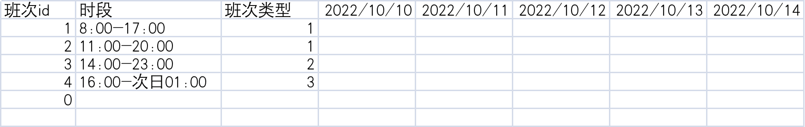
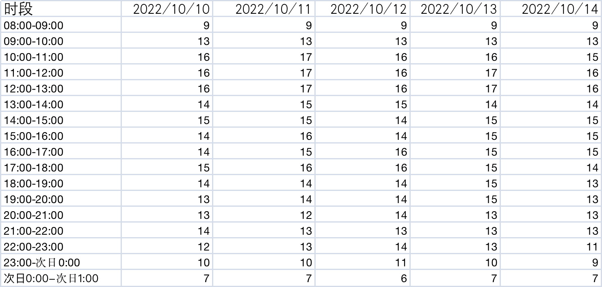
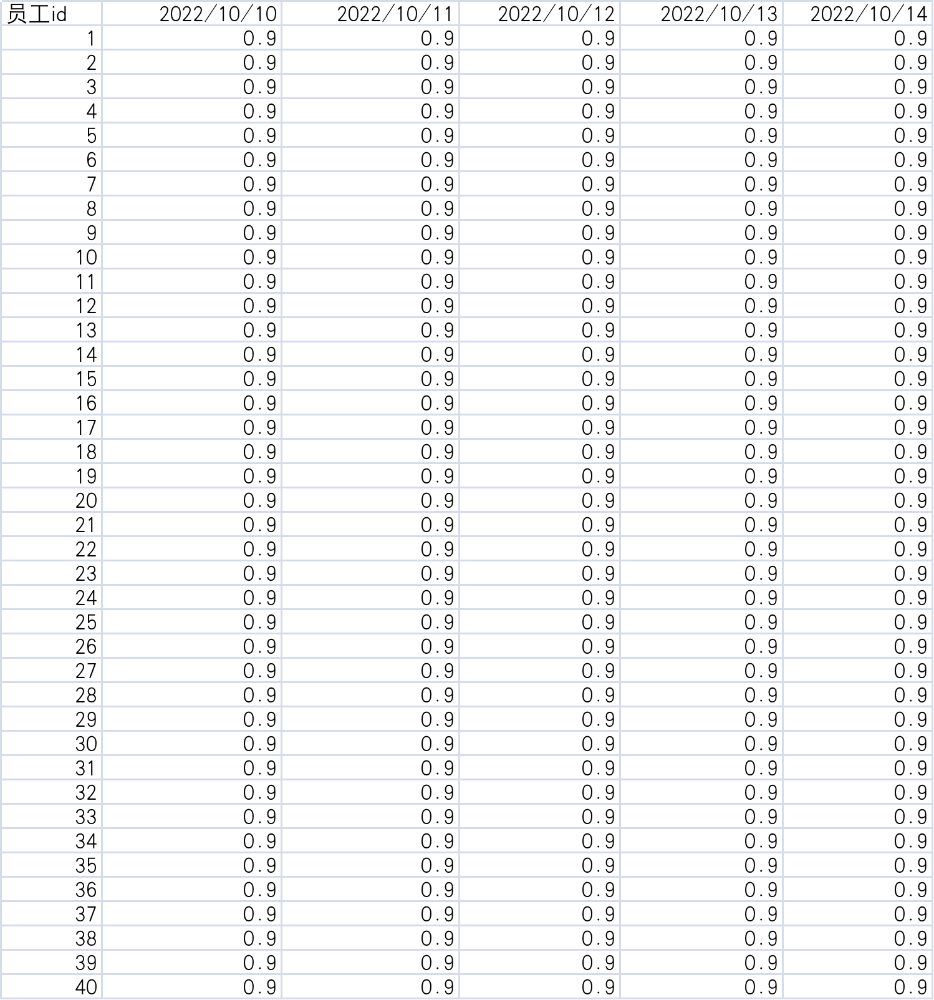

# opt-planer-demo

##输入信息：

每日班次，班次id=0代表休息，可忽略

每日时段需求人力值

//规划实体

每日客服信息 （主要是每天的人力值，随入职天数逐渐到1,1代表成熟人力）

##求解

合理安排客服到每日班次，一个客服一天只有一个班次
最终希望每日时段需求人力和安排的人力越接近越好

##存在问题

给每日时段需求人力和已经安排人力打分约束时，无法让引擎往两者接近的方向优化

gapScore 无法减小

`public Constraint shiftNeedFmtGapV3(ConstraintFactory constraintFactory) {
//某天的一个预测时段
return constraintFactory.from(DayTimeSoltPo.class)
// 连接 日客服信息 by 日预测时段 和日客服班次时段有重叠且为同一天
.join(DayStaffPo.class, Joiners.filtering((dayTimeSoltPo, dayStaffPo) -> isOverlap(dayTimeSoltPo, dayStaffPo)))
// 统计日预测时段内 客服fmp总和
.groupBy((dayTimeSoltPo, dayStaffPo) -> dayTimeSoltPo, ConstraintCollectors.sumBigDecimal((dayTimeSoltPo1, dayStaffPo1) -> dayStaffPo1.getFmp()))
// 计算差距值
.filter((dayTimeSoltPo, bigDecimal) -> computeShiftFmtGapV2(dayTimeSoltPo, bigDecimal).compareTo(gap)>0)
.penalize("shiftNeedFmtGapV3", HardSoftScore.ONE_SOFT,((dayTimeSoltPo, bigDecimal) -> computeShiftFmtGapV2(dayTimeSoltPo, bigDecimal).intValue() ));
}
`

某个时段需求人力15，排了0.9即一个客服，没有继续往上排

computeShiftFmtGap:need=15.00,planed=0.90,gapScore=94.00
[pool-1-thread-1] c.e.t.domain.TableConstraintProvider     : computeShiftFmtGap:need=16.00,planed=0.90,gapScore=94.00
[pool-1-thread-1] c.e.t.domain.TableConstraintProvider     : computeShiftFmtGap:need=15.00,planed=0.90,gapScore=94.00
[pool-1-thread-1] c.e.t.domain.TableConstraintProvider     : computeShiftFmtGap:need=16.00,planed=0.90,gapScore=94.00
[pool-1-thread-1] c.e.t.domain.TableConstraintProvider     : computeShiftFmtGap:need=14.00,planed=0.90,gapScore=94.00
[pool-1-thread-1] c.e.t.domain.TableConstraintProvider     : computeShiftFmtGap:need=14.00,planed=0.90,gapScore=94.00
[pool-1-thread-1] c.e.t.domain.TableConstraintProvider     : computeShiftFmtGap:need=12.00,planed=0.90,gapScore=93.00
[pool-1-thread-1] c.e.t.domain.TableConstraintProvider     : computeShiftFmtGap:need=14.00,planed=0.90,gapScore=94.00
[pool-1-thread-1] c.e.t.domain.TableConstraintProvider     : computeShiftFmtGap:need=14.00,planed=0.90,gapScore=94.00
[pool-1-thread-1] c.e.t.domain.TableConstraintProvider     : computeShiftFmtGap:need=14.00,planed=0.90,gapScore=94.00
[pool-1-thread-1] c.e.t.domain.TableConstraintProvider     : computeShiftFmtGap:need=14.00,planed=0.90,gapScore=94.00
